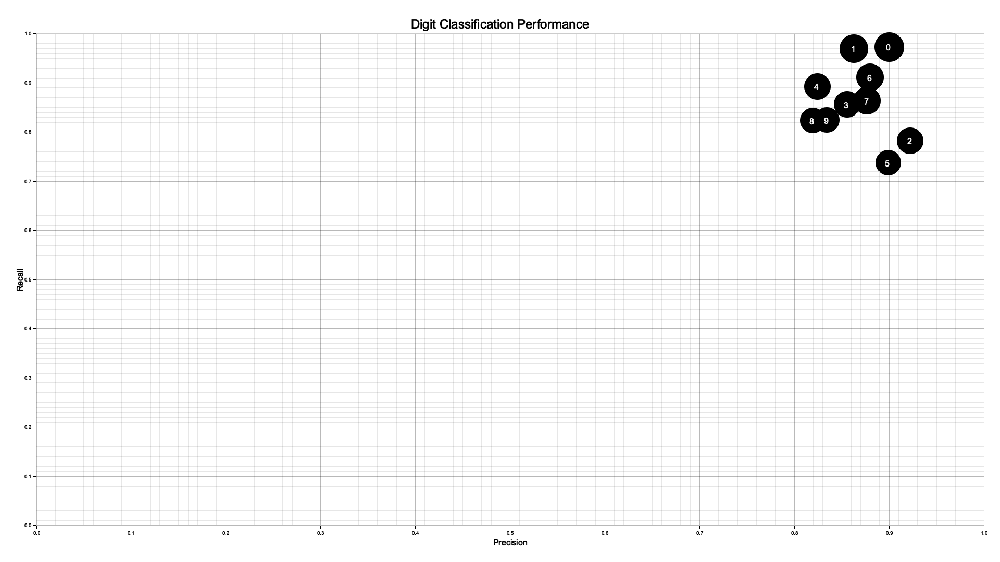
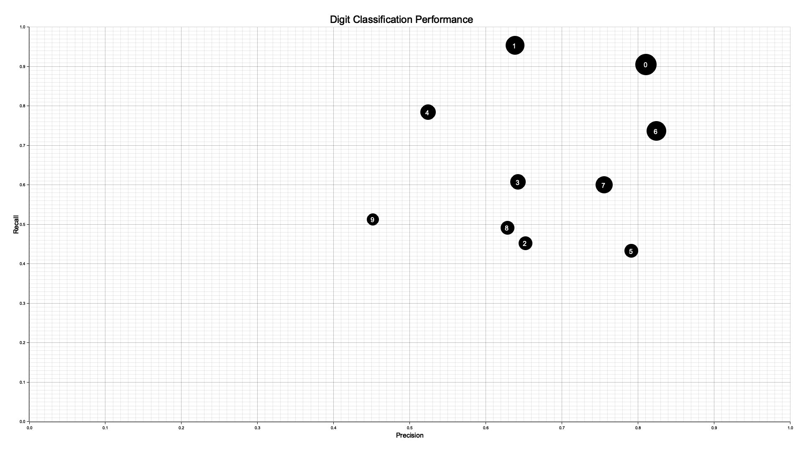

# MNIST Digit Inferencer

A handwritten digit classifier written from scratch in Rust.

This currently implements multiple linear regression to train and classify digits from the MNIST database of handwritten digits. The goal is to understand the mathematics behind supervised learning by building algorithms from first principles using Rust.

---

## Features

- Binary and multiclass digit classification
- Least squares linear regression
- Singular Value Decomposition (SVD) solver
- LAPACK-accelerated SVD implementation
- Rust native Faer SVD implementation 
- Precision, Recall, and F1 score evaluation
- Training and inference modes
- Automatic model serialization to JSON
- Visualization tools for model evaluation

---

## Algorithms

### Linear Regression

Computes the least squares solution using Moore-Penrose Pseudo-inverse through singular value decomposition:

```math
A^TA\hat{x} = A^T\vec{b}\
\\\quad\small\text{Normal Equation}
```

```math
\hat{x} = A^+b\
\\\quad\small\text{Moore-Penrose Pseudo-inverse}
```

```math
A=U\Sigma V^T
\\\quad\small\text{Singular Value Decomposition}
```

```math
A^+=V\Sigma{^+}U^T
\\\quad\small\text{Pseudo-inverse of A}
```

The solver can use Lapack SVD for higher performance compared to nalgebra's SVD solver. Due to memory limitations and the nalgebra lapack wrapper not exposing flags to allow thin SVD, there is a limit to how many images can be trained using Lapack (~50,000). 

As an alternative,  the Rust native Faer library allows for thin SVD where the user can train the full 60,000 images.

Lapack is faster for up to ~10,000 images whereas Faer is more efficient when the training size exceeds 10,000 due to Lapack calculating the full SVD while Faer uses thin SVD. Training 40,000 images using Lapack takes ~35 min (dependent on hardware of course) whereas Faer takes ~13 minutes.

The project explores numerical stability, rank-deficient systems, pseudoinverses, and regularization.

---

## Dataset

The project uses the MNIST handwritten digit dataset.

Training images: 60,000

Testing images: 10,000

Images are 28×28 grayscale pixels.

---

## Building

```bash
cargo build --release
```

---

## Running

```bash
cargo run --release
```

The program provides an interactive menu for training a single digit or all digits using Faer or nalgebra Lapack, as well as classifying digits from the training set. 

The training set size, testing set size, and epsilon can be set by the user at the top of the program:

```rust
const EPSILON: f64 = 1.0;
const N_TRAINING_SET: u32 = 1000;
const N_TESTING_SET: u32 = 10000;
```

---

## Example Output

Trained on 60,000 images and tested on 10,000.

```
Digit: 0
Precision: 0.8999999761581421
Recall: 0.9734693765640259
F1: 0.9352940996075446

Digit: 1
Precision: 0.8628526926040649
Recall: 0.9700440764427185
F1: 0.9133140037543043

Digit: 2
Precision: 0.922374427318573
Recall: 0.7829457521438599
F1: 0.8469601761035292

Digit: 3
Precision: 0.8555885553359985
Recall: 0.8564356565475464
F1: 0.8560118963710031

Digit: 4
Precision: 0.8242481350898743
Recall: 0.8930753469467163
F1: 0.857282506080458

Digit: 5
Precision: 0.8989071249961853
Recall: 0.7376681566238403
F1: 0.8103448332857409

Digit: 6
Precision: 0.8800403475761414
Recall: 0.9112734794616699
F1: 0.8953846249582261

Digit: 7
Precision: 0.8766041398048401
Recall: 0.8638132214546204
F1: 0.870161678227926

Digit: 8
Precision: 0.81920325756073
Recall: 0.8234086036682129
F1: 0.8213005474389626

Digit: 9
Precision: 0.8345035314559937
Recall: 0.8245787620544434
F1: 0.8295114613538194

Number of Tests: 10000
 Number correct: 8658
 Percent Correct: 86.58%
 Average F1: 0.8635565827181514
```

After inferencing, a scatterplot is exported to the `/scatterplots` folder giving a visualization of the results.



The scatterplot shows the results for each digit with:

- x-axis representing Precision
- y-axis representing Recall
- the radius of the dot representing F1 score (bigger is better)


```math
\frac{TP}{TP + FP}
\\\\\quad\small\text{Precision calculated using True Positives and False Positives}
```

```math
\frac{TP}{TP + FN}
\\\\\quad\small\text{Recall calculated using True Positives and False Negatives}
```

```math
F₁=2*\frac{Precision*Recall}{Precision + Recall}
```

An example of a scatterplot when trained on just 100 images:



It can be noticed that even at just 100 images, the digits 0 and 1 are still classified decently well due to the uniqueness of their design.

---


## Future Implementations

- Confusion Matrix
- Logistic Regression
- Gradient Descent
- Principal Component Analysis (PCA)
- Multiclass LDA
- Neural Networks
- Hyperparameter optimization

---

## Motivation

This project was created as a learning exercise to understand how classical machine learning algorithms work internally using the Rust programming language.

Instead of using high-level frameworks, every algorithm is implemented directly using Rust and linear algebra libraries. 